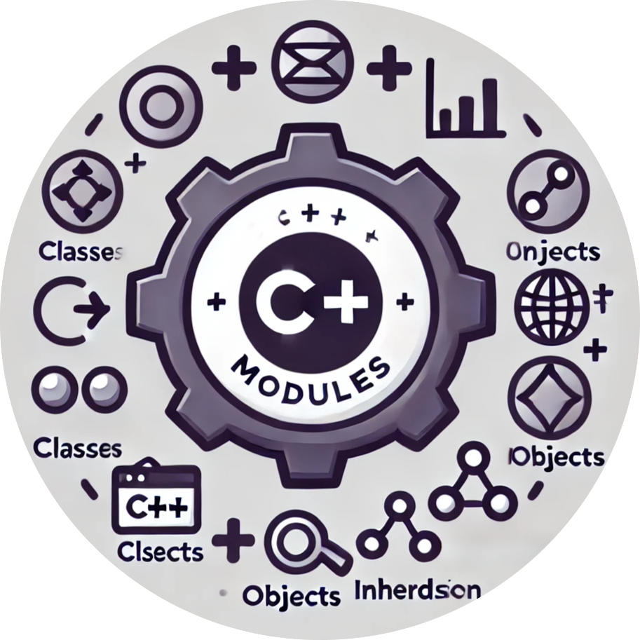

  <h1>👋 Hello, I'm Gonzalo</h1>
  <h4>📚 Currently studying Business Management and coding at 42 Madrid. Here you'll find my completed and ongoing projects:</h4>
  

  <h2>🛠️ Projects Overview</h2>
  
  <!-- Tabla para organizar los proyectos en filas y columnas -->
  <table align="center">
    <tr>
      <!-- Fila 1 -->
      <td align="center">
        
        
LIBFT

      </td>
      <td align="center">
        
        
BORN 2 BE ROOT

      </td>
      <td align="center">
        
        
GET NEXT LINE

      </td>
      <td align="center">
        
        
PRINTF

      </td>
    </tr>
    <tr>
      <!-- Fila 2 -->
      <td align="center">
        
        
FDF

      </td>
      <td align="center">
        
        
MINITALK

      </td>
      <td align="center">
        
        
PUSH SWAP

      </td>
      <td align="center">
        
        
MINISHELL

      </td>
    </tr>
    <tr>
      <!-- Fila 3 -->
      <td align="center">
        
        
PHILOSOPHERS

      </td>
      <td align="center">
        
        
CUB3D

      </td>
      <td align="center">
        
        
NETPRACTICE

      </td>
      <td align="center">
        
        
CPP MODULES

      </td>
    </tr>
    <tr>
      <!-- Fila 4 -->
      <td align="center">
        
        
WEBSERVER

      </td>
    </tr>
  </table>

  

  <h2>👨‍💻 Connect with me:</h2>
  &nbsp;&nbsp;&nbsp;
  
  
  

  <h2>💻 My Expertise:</h2>
  &nbsp;&nbsp;&nbsp;
  &nbsp;&nbsp;&nbsp;
  
  
  

  <h2>📊 Top Languages:</h2>
  

