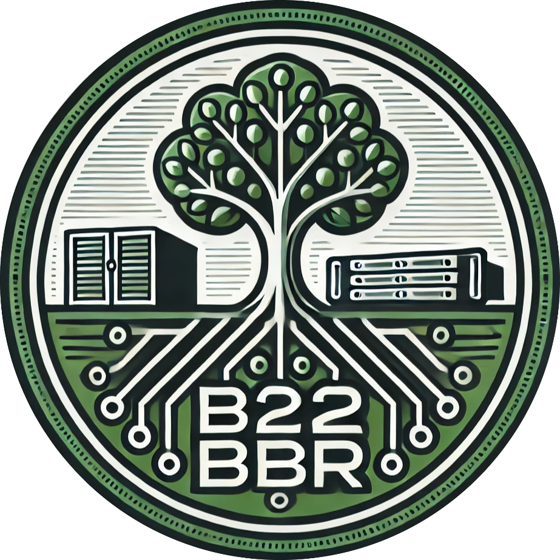
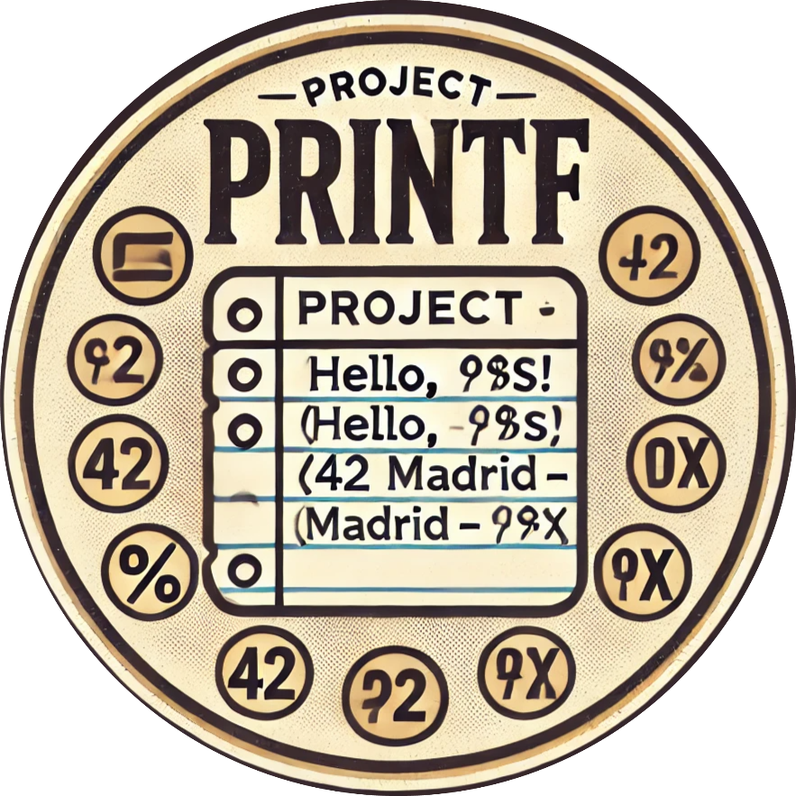
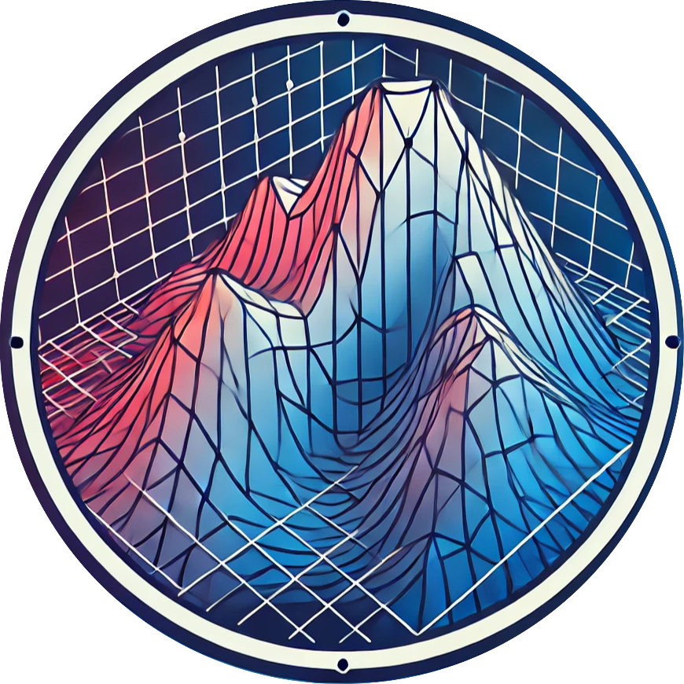
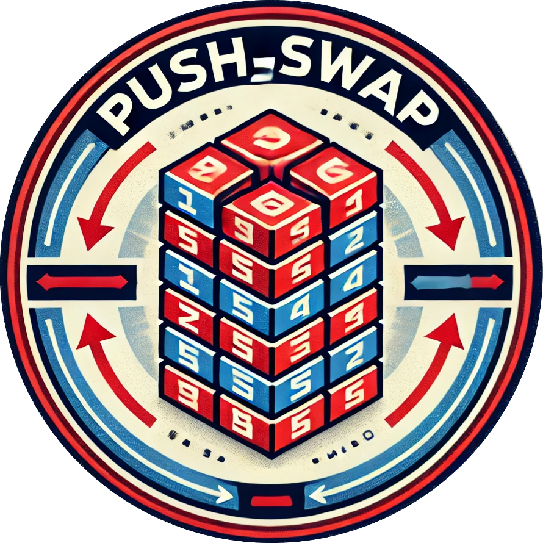
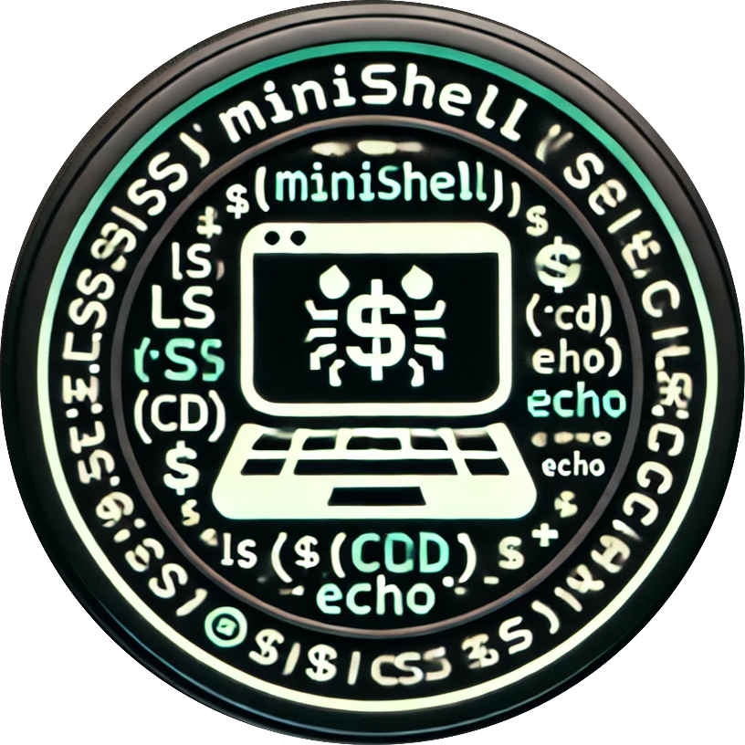
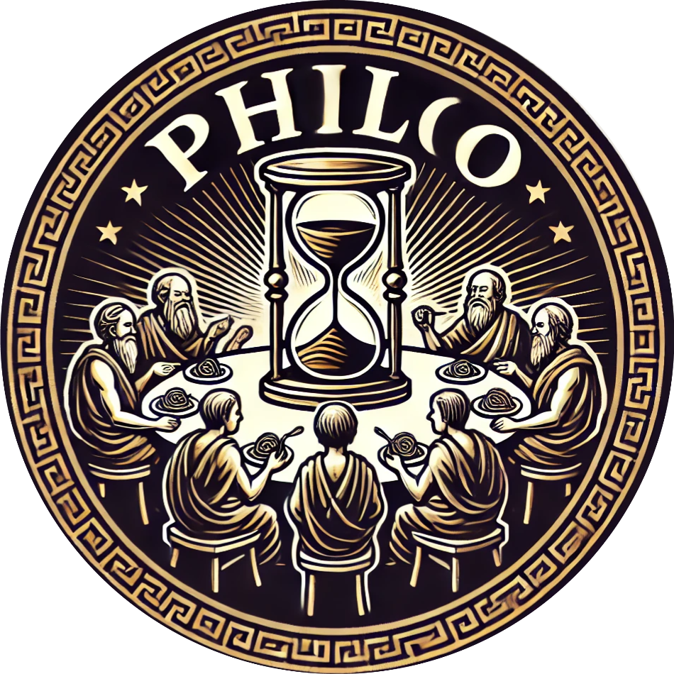
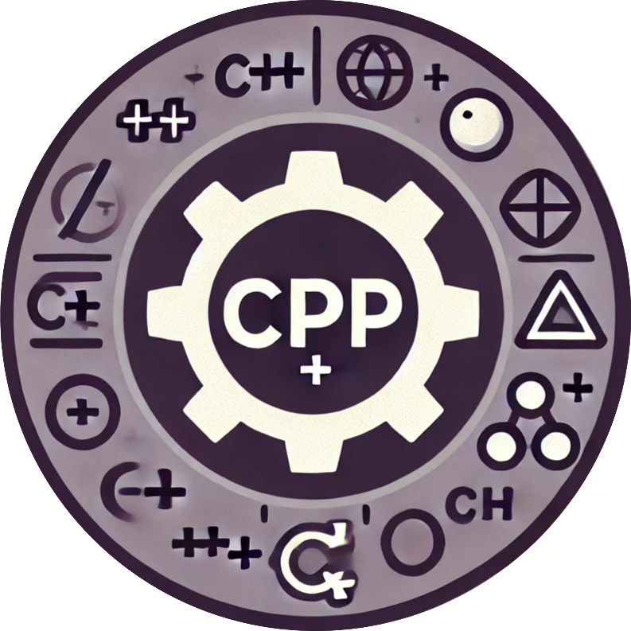

  <h1>👋 Hello, I'm Gonzalo</h1>
  <h4>📚 Currently studying Business Management and coding at 42 Madrid. Here you'll find my completed and ongoing projects:</h4>
  

  <h2>🛠️ Projects Overview</h2>
        
        
        
        
        
        
        
        
        
        
        
        
        

  

  <h2>👨‍💻 Connect with me:</h2>
  &nbsp;&nbsp;&nbsp;
  
  
  

  <h2>💻 My Expertise:</h2>
  &nbsp;&nbsp;&nbsp;
  &nbsp;&nbsp;&nbsp;
  
  
  

  <h2>📊 Top Languages:</h2>
  

